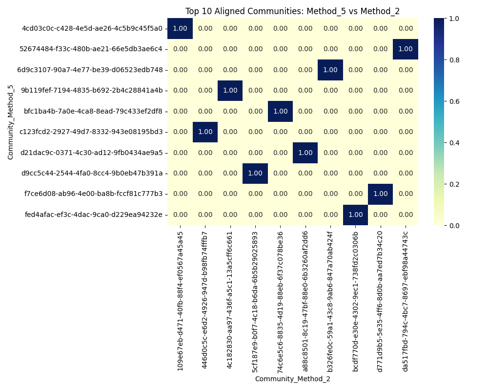
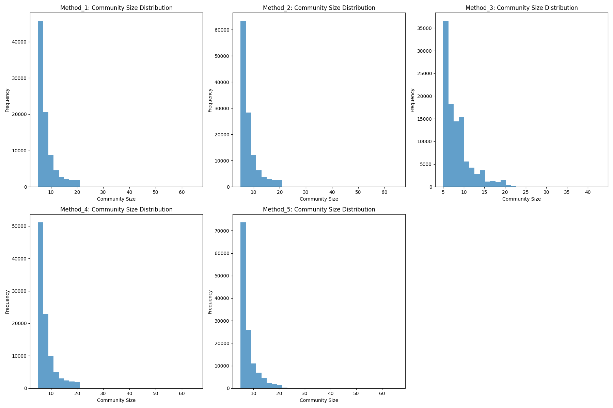
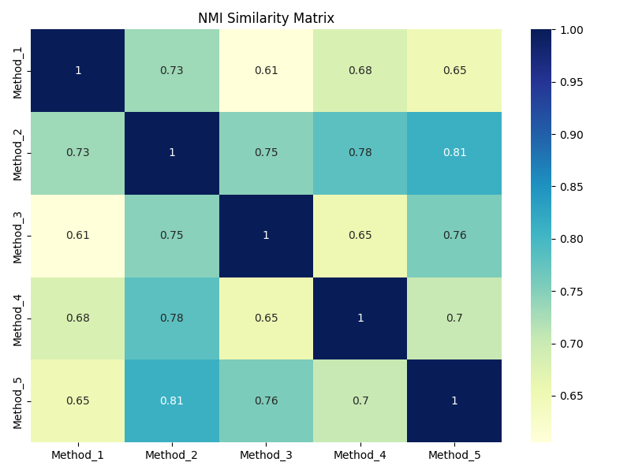

# Analysis Outputs

This document lists all key files generated by the analysis, with short descriptions and figures (where available).

## Data Outputs (`output/`)

- **`aligned_communities_Method_5_Method_2.csv`**: Aligned communities (greedy Jaccard match) between two most similar methods.
- **`community_summary.csv`**: Summary statistics for each community detection method.
- **`nmi_similarity_matrix.csv`**: Pairwise Normalized Mutual Information (NMI) similarity matrix.

## Figures (`figures/`)

### aligned_communities_heatmap_Method_5_Method_2.png
*Heatmap of top aligned communities for the two most similar methods.*

### community_size_distributions.png
*Histogram of community size distributions for all methods.*

### nmi_similarity_matrix.png
*Heatmap of NMI similarity matrix.*

